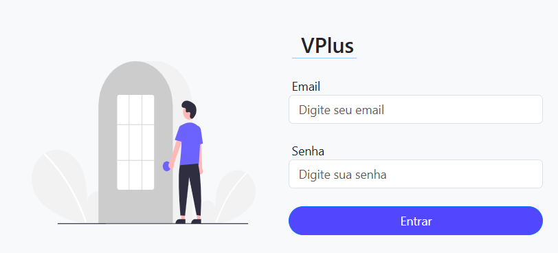
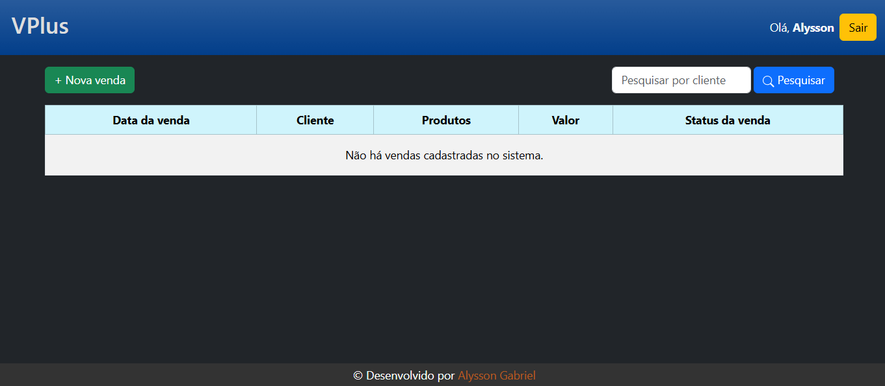
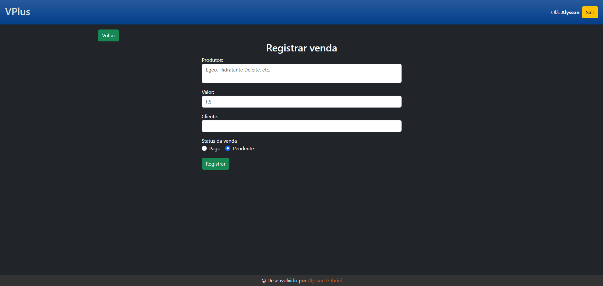
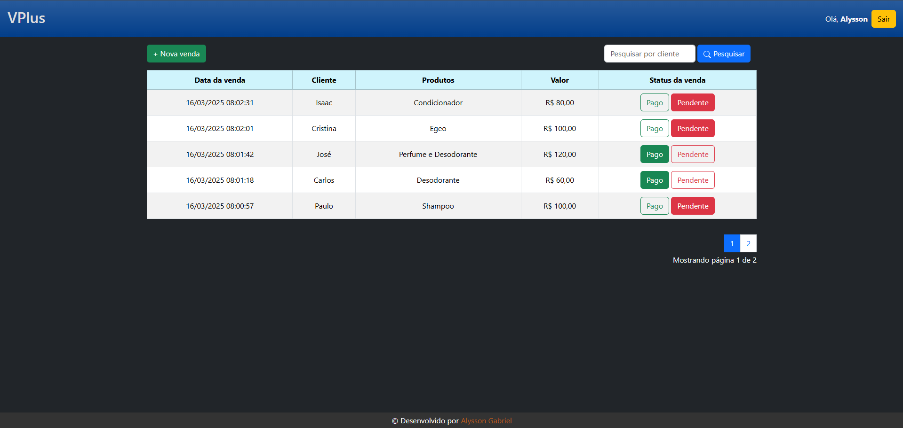

# VPlus - Gerenciamento de vendas

  
  
 

Vendaplus (ou VPlus) é um sistema com o propósito de gerenciar vendas de forma simples e fácil, oferecendo uma experiência mais agradável para o usuário.

## Índice
- [Tecnologias Utilizadas](#tecnologias-utilizadas)
- [Instalação](#instalação)
- [Funcionalidades](#funcionalidades)
- [Demo](#demo-screenshots)
- [Contribuição](#contribuição)
- [Licença](#licença)
- [Contato](#contato)

## Tecnologias Utilizadas
Aqui estão as tecnologias e ferramentas utilizadas no projeto:


- **PHP**: Linguagem de programação utilizada para o backend.
- **Bootstrap**: Framework CSS para estilização e design responsivo.
- **Composer**: Gerenciador de dependências para PHP.
- **MySQL**: Banco de dados relacional utilizado para armazenar dados.
- **JavaScript**: Utilizado para interatividade no frontend (dentro de tags `<script>` no PHP).
- **Apache**: Servidor web utilizado para hospedar e rodar o projeto.

## Instalação

Obs: Antes de começar, certifique-se que o servidor Apache e o MySQL estão rodando.

## 1. Clonar o repositório
```bash
git clone https://github.com/alyssongab/vendaplus.git
```
## 2. Criar um arquivo 'config.php' na pasta db/:
```bash
vendaplus/app/db/config.php
```

## 3. Inserir as credenciais do seu banco de dados:
```php
<?php
define("DB_USER","seu_usuario");
define("DB_PASSWORD","sua_senha");
```
## 4. Importar o arquivo .sql no seu banco de dados:
Após importar, verifique a conexão com o banco, basta rodar o arquivo **'teste_conexao.php'**

## 5. Fazer login com as seguintes credenciais:
- **email:** `vplus@admin`
- **senha:** `admin`

Obs: É possível verificar as credenciais de login no banco de dados também.

## Demo (Screenshots)

## Login


## Tabela vazia


## Registro de nova venda


## Tabela com vendas


## Contribuição

Sinta-se livre para contribuir com o projeto :D

1. Faça um fork do projeto.

2. Crie uma branch para sua feature (git checkout -b feature/NovaFeature).

3. Commit suas mudanças (git commit -m 'Adicionando NovaFeature').

4. Faça um push para a branch (git push origin feature/NovaFeature).

5. Abra um Pull Request.

## Licença
Este projeto está licenciado sob a licença MIT - veja o arquivo LICENSE para mais detalhes.

## Contato
Alysson Gabriel - https://linkedin.com/in/alyssongab

Link do Projeto: https://github.com/alyssongab/vendaplus